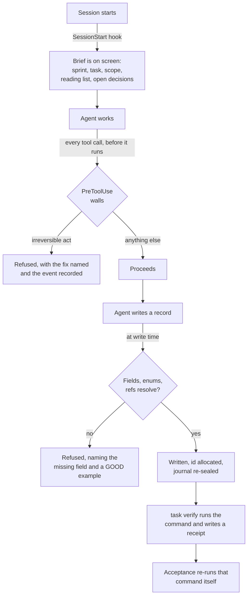
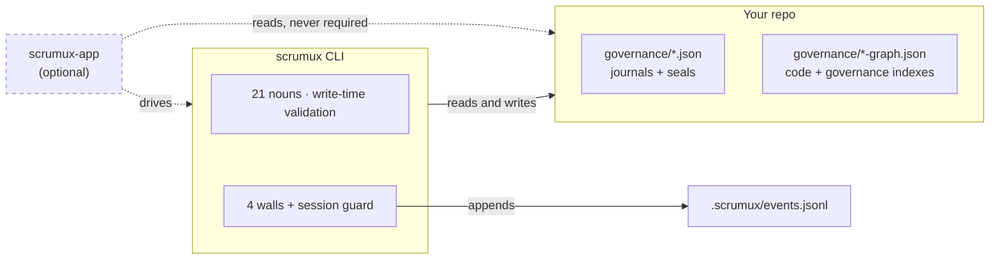
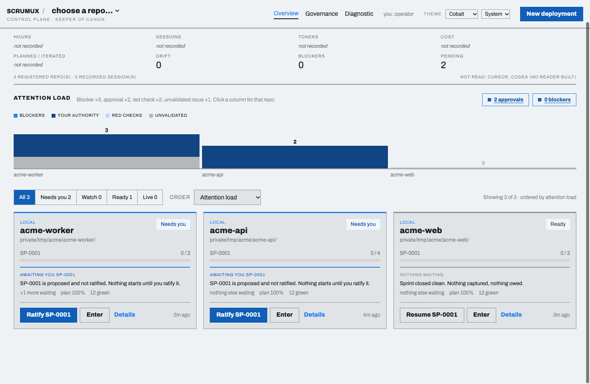

<p align="center">
  
</p>

**A governance harness for AI coding agents.** It installs into a code
repository and makes the record — not the chat log, not the agent's
recollection — the thing the next session works from.

---

## The problem

An AI coding agent starts every session knowing nothing. It rebuilds its
understanding by grepping and decides things that live only in a conversation
you will close; next week it re-derives the understanding, re-litigates the
decision, and undoes the fix. Then it says "done, all tests pass," which is a
sentence, not evidence.

Four structural failure modes:

| Failure | What scrumux does instead |
|---|---|
| **Self-reported success.** The claim and the proof come from the same party. | Every task names one command. `task verify` runs it and writes a receipt: command, exit code, what ran. Acceptance refuses a red receipt — and re-runs the command itself rather than reading the receipt. |
| **Scope drift.** Asked to fix one thing, it tidies four others. | Every task carries a written scope, an explicit out-of-scope list, and a named file list with a reason per file. The list is load-bearing: the close recomputes receipt freshness against exactly those paths, and `task lint` calls out a scope sentence naming a path the order does not list. |
| **Amnesia.** Context ends and the plan dies with it. | State lives in JSON journals in the repo. A cold agent runs one command and gets its sprint, its task, the scope, the reading list, what calls the files it is about to change, and which decisions bind them. |
| **Rule-rewriting.** The agent edits the thing judging it. | Four irreversible acts are refused by hooks that run *before* the tool does. One of them is writing to the harness's own machinery. |

---

## Install

The machinery is **copied** into your target repo, never linked. Delete the
clone afterwards and your repo keeps working.

```sh
git clone https://github.com/LBDavid98/scrumux-cli-public.git /tmp/scrumux-src \
  && (cd /tmp/scrumux-src && npm ci && npm run build) \
  && /tmp/scrumux-src/.deploy-claude/scripts/scrumux harness deploy /path/to/your/repo \
  && /tmp/scrumux-src/.deploy-claude/scripts/scrumux harness verify /path/to/your/repo
```

**`harness deploy`** compares byte for byte, not by timestamp, reporting each
item CREATED, UPDATED, UNCHANGED, REMOVED or KEPT. It seeds empty journals,
never touching an existing one. It writes `.claude/settings.json` at your repo
root — the only place Claude Code resolves it — and if you already have one it
leaves yours alone and names the missing pieces instead of merging blindly. It
builds a code index from its own checkout, then runs the validator and **fails
the install if your repo does not come back clean.**
With `--json`, its envelope's `commit_paths` lists every path it created,
changed or removed that belongs in your history — payload, manifest, seeded
journals, settings, `.gitignore`, the code index when it differs from the
committed one apart from its build stamp and build commit — so committing exactly that list
leaves a clean checkout (R-020, R-022). A repo's own `CLAUDE.md`, preserved as
`CLAUDE.pre-harness.md`, stays pointed at on every deploy (R-021).

**`harness verify`** checks placement (a settings file in the wrong directory
is silently inert), that the file parses, that every declared hook resolves and
can start on this platform, that the payload matches the manifest (rules, skills and schemas that differ are
reported as variance, never a failure — R-019; walls, scripts and the bundle must
match), and that the
journals are schema-valid — then **executes all 25 command surfaces inside your
repo**, because a file being present does not prove the command works.

```
  ok   hook-chains              all 4 chains declared: PreToolUse:Bash|PowerShell PreToolUse:Read PreToolUse:Edit|Write|NotebookEdit SessionStart
  ok   hooks-executable         every hook declared in settings.json resolves and can start on this platform (darwin)
  ok   surfaces-run             all 25 registered surface(s) executed and answered
  ok   machinery-drift          all 32 installed file(s) match .claude/DEPLOYED byte for byte

harness verify: /path/to/your/repo is INSTALLED — 10/10 checks pass. Installed is not live:
whether these hooks fire is decided by the project root a session was LAUNCHED with, which
nothing inside it can change.
```

That root is resolved once, at launch. When `$CLAUDE_PROJECT_DIR` names a
different repo, `verify` prints a `session-topology` WARN: the hooks are
installed, and they are not the ones watching you. Re-run `deploy` any time to
take a newer version; your records are never overwritten.

---

## It runs on Windows

scrumux was originally POSIX shell, `jq`, and three Python modules. On a Windows
box without Git Bash that is not a slow harness — it is no harness. The whole
thing has been rewritten in TypeScript. **Bash, jq and Python are retired and
deleted from the tree.**

- **The CLI is a Node script.** `.claude/scripts/scrumux` is the entry point
  everywhere, dispatching in-process into one `.mjs` bundle beside it. Windows
  ignores its `#!/usr/bin/env node` shebang, so an operator there runs
  `node .claude\scripts\scrumux <noun> <verb>`. It works as *either* module kind
  — no `require`, no `import` statement, no top-level await — because with no
  file extension Node decides ESM-or-CJS from the nearest `package.json`, which
  is yours and may say anything.
- **The four walls ship as `.mjs` bundles** under `.claude/dist/`, with the
  hook chains declared in **exec form** — `"command": "node"`, bundle path in
  `args` — the only shape that starts on a stock Windows box.
- **The project-dir placeholder is braced**, `${CLAUDE_PROJECT_DIR}`. A bare
  `$CLAUDE_PROJECT_DIR` resolves to `$null` under PowerShell: a wall pointed at
  nothing.
- **The shell chain matches `Bash|PowerShell`, not `Bash`.** Without Git Bash,
  Claude Code never registers the Bash tool and routes every shell command
  through the PowerShell tool. A chain matched on `"Bash"` alone is four walls
  declared and dead, with nothing in the transcript to say so. `harness verify`
  requires the matcher to cover both names.

The walls also had to *understand* PowerShell, or they would read
`Remove-Item -Recurse -Force C:\repo` as a command with no `rm` in it. So they
carry a second dialect: cmdlets and aliases, parameter abbreviation resolved in
the strict direction (`-Rec` is `-Recurse`, `-For` is `-Force`), backtick
escaping, quoted-parameter detection (`Remove-Item "-WhatIf" x` passes a
*string*, not a switch), `iex` and `-EncodedCommand` payload expansion,
cmd.exe's `rd /s /q`, and `[IO.File]::` .NET calls. The attestation path is
spelled both ways: a remedy nobody on that platform can type is a wall people
route around.

```
$ Remove-Item -Rec -For /srv/app
BLOCKED by block-destructive: recursive force delete outside temp space. CLAUDE.MD hard
limit: never run destructive filesystem commands or purge a database without backing it
up first. Back up or git-stash the target first; the one sanctioned path is to re-run
prefixed with HARNESS_BACKUP_DONE=1, which this hook records in
governance/attestations.jsonl.
```

CI runs the TypeScript suite, the build and the smoke test on Windows, macOS
and Linux. What it cannot see is a live session, so the claim is "the chains
are correctly declared and the bundles start", not "enforcement is confirmed
live there".

### "It's TypeScript" — what that means for your repo

**Your repo does not become a TypeScript repo.** What the harness governs is
language-agnostic: it reads your journals, walks your call graph and refuses
irreversible acts identically whether the repo underneath is Go, Python, Rust,
Elixir or a pile of notebooks. The code index ships twelve tree-sitter languages
(thirteen `.wasm` blobs — tsx is a dialect of typescript) so "what calls what"
is not a claim about one ecosystem.

**Nothing is installed into your repo.** No `node_modules`, no `package.json`,
no lockfile, no build step, no postinstall. What lands is a short Node entry
script, bundled `.mjs` files, JSON schemas, markdown and your own journals —
every dependency bundled at *our* build time, in *our* repo, before anything is
copied. You can read every file that arrives.

**The only runtime requirement is Node ≥ 22.11.** No `jq`, no Python, no POSIX
shell, no compiler, no container.

**Is it stable after a rewrite?** For several weeks both implementations ran
side by side on the same inputs, the original as oracle, a differential harness
comparing stdout, stderr, exit codes, the recorded `.argv` and the entire
post-state tree **byte for byte** — including the hand-printed seal format,
deliberately not JSON-formatted so a single byte of drift is a tamper signal.
Bash was deleted only once TypeScript was byte-identical across the whole
corpus. Guarding it now: 1,760 unit tests with enforced coverage floors, 32
shell suites driving the built CLI as a real process against real deploys, a
property test fuzzing the command tokenizer against the original `awk` on ten
thousand generated cases per run, and a smoke test driving the built binary end
to end on all three platforms.

---

## A governed session, end to end

The job: a command-line tool that reads a CSV and prints column stats. The
first piece is the parser. Everything below is real output.

**Open the session.** A session *is* a sprint; there is no separate planning
ceremony.

```sh
$ .claude/scripts/scrumux epic new --name "CSV summary tool" --desc "Reads a CSV, prints per-column stats"
E-0001
$ .claude/scripts/scrumux sprint new --epic E-0001
SP-0001
$ .claude/scripts/scrumux task new \
    --title "The parser turns a header row into keys" \
    --check "parse_csv returns one dict per data row keyed by the header, and python3 -m pytest tests/test_parse.py exits 0"
T-0001
```

`--check` is the sentence that decides *done*. Never optional, in any lane.

**Write the order** — the brief the agent works from, and the reason it does
not have to go looking.

```sh
$ .claude/scripts/scrumux task order T-0001 --light \
    --scope "Implement parse_csv in src/parse.py — first row is the header, each later row becomes one dict" \
    --verify "python3 -m pytest tests/test_parse.py" \
    --out "The CLI entry point and the output formatting — later tasks" \
    --file "src/parse.py | the stub to replace | ~20 lines"
T-0001 order set
```

`--scope` is what to change; `--verify` the one command that proves the check;
`--out` what must not be touched, repeatable; `--file "path | why"` which files
to open **and why**, so the agent reads instead of searching. `--light` marks an
order minted from something you said rather than packaged by tooling: it relaxes
the paperwork and **never** the acceptance check or the verification command.

**Ratify.** A sprint refuses a task whose order is incomplete, and
ratification is yours alone.

```sh
$ .claude/scripts/scrumux sprint add SP-0001 T-0001
T-0001 added to SP-0001
$ .claude/scripts/scrumux sprint ratify SP-0001 --by user --authority direct
SP-0001 ratified
```

Ask for that before the order exists and you get the refusal, not a
half-planned sprint:

```
scrumux sprint add: error: task order first: T-0001 has no task_order — complete it
before it can enter a sprint (D-0005): scrumux task order T-0001 --scope ...
--verify ... --file "path | why"
```

**Now the agent starts — informed.** One command, and it has the frame:

```sh
$ .claude/scripts/scrumux task brief T-0001
=== TASK BRIEF T-0001 (2026-09-03) ===
Title:  The parser turns a header row into keys
Acceptance check: parse_csv returns one dict per data row keyed by the header, and
python3 -m pytest tests/test_parse.py exits 0

--- Gates ---
sprint: T-0001 is in ratified sprint SP-0001 — OK (D-0004)
parallel: OK (1 of 1 slots)

--- Scope ---
IN:  Implement parse_csv in src/parse.py — first row is the header, each later row becomes one dict
VERIFY WITH: python3 -m pytest tests/test_parse.py
OUT (do not touch):
  - The CLI entry point and the output formatting — later tasks

--- Reading list (open these, for these reasons — do not search) ---
  src/parse.py
    why: the stub to replace
    expected diff: ~20 lines

--- Also bearing on these files (scrumux graph gov bearing --task T-0001) ---
  this order CHANGES: src/parse.py

--- Code graph: what changing these files touches ---
  src/parse.py
    callers: tests/test_parse.py
    callees: none in the index

--- Ground truth (run these before assuming) ---
  (none declared)

--- History for T-0001 ---
  (no log entries yet)

VERDICT: gates pass. Set in_progress (scrumux task status T-0001 in_progress) and
implement within scope.
```

**Verification is an exit code.** Run it against the stub and the receipt is
red:

```sh
$ .claude/scripts/scrumux task verify T-0001
...
RESULT: FAIL (exit 1)
  FAIL verification_command for T-0001 exit 1
EVIDENCE-END

RECEIPT: recorded on T-0001 (rc=1, checks_run=1, checks_failed=1)
VERDICT: 1 check(s) FAILED. The task stays in_progress (D-0006). If the cause is not
obvious, dispatch the debugger agent — never patch around a failure you don't understand.
```

You cannot accept that, even if you want to:

```sh
$ .claude/scripts/scrumux task accept T-0001 --by user --authority direct
scrumux task accept: error: accept: T-0001's last task-verify receipt is RED (rc=1,
checks_failed=1, dated 2026-09-03) — acceptance refuses a red receipt (CLAUDE.MD
boundary 5). Fix the failure, re-run .claude/scripts/scrumux task verify T-0001, then accept.
```

**Fix it, verify green, log the evidence, close.**

```sh
$ .claude/scripts/scrumux task verify T-0001
RESULT: PASS (exit 0)
RECEIPT: recorded on T-0001 (rc=0, checks_run=1, checks_failed=0)

$ .claude/scripts/scrumux log new --task T-0001 --title "parse_csv keys each row by the header row" \
    --did "Replaced the NotImplementedError stub in src/parse.py with a header-zip. python3 -m pytest tests/test_parse.py rc=0; 1 file changed, 4 insertions, 1 deletion" \
    --verified "task verify T-0001 receipt rc=0, checks_run=1, checks_failed=0"
L-0001

$ .claude/scripts/scrumux session check
=== SESSION CHECK (2026-09-03) ===

  ok   receipt green            every task claiming done carries a green receipt
  ok   command match            each receipt ran the command its order names
  ok   receipt fresh            no covered file changed after its receipt
  ok   checks ran               every receipt ran at least one check
  ok   strays/secrets           no temp or secret-pattern files in the working tree
  ok   nothing mid-flight       no task left in_progress
  ok   sprint discipline        every worked task belongs to a ratified sprint
  ok   live stubs               no stub markers in live code

SUMMARY: 0 fail(s) of 8 check(s)
VERDICT: clean. Push is User's call.
```

Six of those are FAILs and two advisory: the ways a green receipt can lie,
plus the two irreversible states. Bookkeeping never appears here.

**And you decide.**

```sh
$ .claude/scripts/scrumux task accept T-0001 --by user --authority direct
re-running T-0001's verification before accepting: python3 -m pytest tests/test_parse.py
  re-run passed (exit 0)
T-0001 accepted
  VERIFIED — its command was re-run by the acceptor, not read off the receipt.
  next: the attested claim is now confirmed by something that is not its author
SP-0001 -> complete
```

Acceptance **re-runs** the command rather than trusting the receipt. A receipt
records what happened when the agent ran it; it cannot record whether the
command still proves what the order asked. A task once arrived green with its
acceptance check quietly narrowed from ten required sections to eight, and
nothing in the machine noticed.

Anything out of scope found mid-task is **captured, never fixed in passing**:
`scrumux issue new` files it with a repro and a proposed fix, the work continues,
and a different identity validates it later.

---

## The manifesto, in brief

Full text and the incident behind each article: [`RULINGS.md`](RULINGS.md).

> **The governance supports the agent; the agent does not exist to support
> the governance.**

A mechanism that cannot be traced to that sentence is the thing that is wrong.

**The Prime Article: the harness does not block the user.** Every constraint
binds the *agent*; none binds the person. Your instruction is authority to be
executed and recorded, not input to be adjudicated — *"a prompt that asks the
user to confirm their own instruction is a defect twice over: it delays the
work, and it trains the user to click through confirmations, which destroys the
one gate that matters at the one moment it matters."*

1. **The agent is not the failing component.** Six acceptance runs, correct
   code six times out of six; four failures, all bookkeeping, over four files
   — two `__init__.py` the product needed and bytecode the harness generated —
   and zero prevented damage. First suspect is the instruction set, the order,
   or the harness.
2. **The harness is inert until followed.** Text the agent reads, scripts the
   workflow invokes. Any claim it "enforces" or "ensures", outside the four
   walls, is an overclaim.
3. **Force is reserved for destruction.** Exactly four hooks may stop a tool
   call; a fifth must prove the irreversible act it prevents.
4. **A check may claim only what it computes.** Not "would this catch
   something" but *"what is the weakest artifact that passes this, and would I
   accept it?"* Keeping a proxy and reporting it as verification is prohibited.
5. **The error message is the instruction set.** A refusal that states a fact
   without naming the next action is a defect.
6. **Evidence is written by programs.** A receipt records the command, the exit
   code and what ran — written by `task verify`, never narrated.
7. **Records exist to change future action, not to describe past work.** An
   audit found 870 records whose only subject was another record; all deleted.
   Name the future reader and the action it changes, or don't write it.
8. **A mechanism pays for itself in incidents prevented, not imaginable.**
   Every rule, check, gate and record type is presumed unnecessary. Removal is
   always in scope.
9. **Every layer is complete without the layer above it.** The CLI performs
   every governance activity with no app, no server, no network — the
   configuration under test.
10. **Irreversible acts belong to a person.** Accept, reject, ratify, decide,
    authorize. Producer separates from verifier: *the verifier need not be a
    person, but it must hold a distinct issued identity.*

Admission test for anything proposed: does it feed context in before work,
guard an irreversible act, or make a lie visible at the end?

---

## What runs without being asked

**An agent should not have to remember to be governed.** Anything a program can
do, a program does; what is left is judgement and the reasons behind a choice.
Most of the machinery never appears in an instruction — it fires on an event, or
at the moment of a write.



The agent was told to do none of those steps. What it *is* asked for is the
short list a program cannot compute:

| Asked | Why it can't be derived |
|---|---|
| The acceptance check, *before* work starts | It is a claim about what "done" means. Nothing in the tree knows it yet. |
| The scope, and what is explicitly out of it | The boundary is a decision, not a fact about the code. |
| Why each file is in the order | The code graph knows what *calls* what. It does not know what you *intend*. |
| The rationale on a decision, including what was rejected | The road not taken leaves no trace to read. |
| Evidence on an issue verdict | The verdict is the deliverable; a program cannot reproduce a bug it was not shown. |

Everything else — who acted, the exit code, which files changed, which
refusals fired, the ids, the timestamps — comes from the machine or the
record.

### The three layers, and why each stands alone



The dashed lines are Article 9. The hooks emit events knowing nothing about
listeners; the event file is valid with zero consumers. The app adds
cross-session observation and review support, and the CLI does not know it
exists. Delete the app and your repo is still governed.

## Context building

An agent with no memory rebuilds understanding by searching: slow, incomplete,
and confident about *what the code does* while structurally blind to *what was
already decided about it*. Grep proves absence; it never proves intent. A stub
that refuses on purpose and a stub nobody finished look identical.

scrumux answers both questions from two indexes, built from repo fact, with no
model in either path — a fact a model guessed at is not a fact.

### Index one: what calls what

`graph code` is a **reader/builder split**: the builder needs tree-sitter and
thirteen committed grammar blobs (twelve languages); readers need nothing but the JSON on disk.

```sh
$ scrumux graph code stats
graph code: index built from 38055eb2 at 2026-09-03T18:03:32Z; HEAD is 38055eb2 —
0 commit(s) behind; built from a DIRTY tree. Current.
files   3 indexed
symbols 2  python=2
edges   2
NOT INDEXED  none — every source language in this tree has a grammar
other files  49 (no language mapped: docs, data, binaries)
```

Every query is stamped with the commit it was built from and how far behind HEAD
that is now, so a stale answer announces itself. A file whose language has no
grammar is **counted and named**, never skipped in silence — a silently skipped
file looks exactly like a file with nothing in it.

`harness deploy` builds this index into every target it installs, so a deployed
repo has a working code graph while carrying no parser at all. Ask it to build
one anyway and it names what is missing and where to run it:

```
graph code build: error: the tree-sitter runtime is not in this checkout. The BUILDER
needs it; readers do not.
  Build from a harness checkout that has them:  scrumux graph code build --repo <target>
  `scrumux harness deploy` does exactly this for every target it installs.
```

Queries: `callers`, `callees`, `symbols <file>`, `find <name>`,
`near <id> [n]` (within n call-hops, both ways), `stats`, `index` (freshness).

### Index two: what ruled on what

The journals already encode a graph — every record carries refs to other
records — and for a long time nothing traversed it, so provenance was
reconstructed by hand every session. One decision named four issues in its
prose while its refs carried one, so three re-listed as unruled for cycles. One
issue was put to the owner at least four times because no decision referenced
it. Both are edge problems, invisible without traversal.

`graph gov bearing` is the query that pays for the whole thing: **which
recorded decisions bind the files I am about to change?**

```sh
$ scrumux graph gov bearing --file src/parse.py
path changes src/parse.py  also T-0001
D-0001 [changes src/parse.py via T-0001] CSV values stay strings; no type inference at parse time
bearing: 1 decision(s)/issue(s) over 1 path(s)
```

Nothing in this session's context window contains that decision. Its rationale
records the rejected option and why: inferring types at parse time turns a zip
code of `01234` into `1234`, and the loss is silent. An agent that opens
`src/parse.py` without that line adds type inference, cleanly, with tests, and
calls it an improvement. Not a careless agent, an *uninformed* one — and the
chat log where the ruling happened is closed.

Every reader **self-heals a missing index** rather than reporting one, and
`gov index` rebuilds a stale one instead of complaining — including one whose
*shape* predates a library change, which mtimes cannot see.

Other queries: `provenance <id>` (what bears on a task, both directions),
`inbound` / `outbound`, `impact <id> [n]`, `orphans` (records nothing points
at), `dangling` (refs naming a record that is gone), `stats`.

### What ties them together

- **`status session`** is wired to the SessionStart hook, so an agent's first
  message is written already knowing where the work stands. It answers from the
  journals and git, never chat memory, and **cannot exit nonzero** — a failure
  to brief is a failure to start work. Cold, in a fresh repo: *"no ratified
  sprint in flight — clear to assemble one"*, plus the next command.
- **`task brief`** is the frame for one task, shown in full above, with both
  graph blocks resolved for exactly the files this order touches. The code-graph
  block **degrades loudly**: silence would read as "nothing calls this file",
  the most dangerous wrong answer it could give.
- **`task lint`** checks an order is well-formed *before* code is written,
  separating hard failures from advisories and naming the judgement still left
  to a human: *"MANUAL: one-sitting check — can this complete without pausing
  mid-state? If not, split it; never widen it."*
- **`records check`** sweeps schemas, cross-journal refs, the rules chain and
  the content seals. A rule declares which skills and scripts it depends on and
  this verb resolves those pointers, so a rule cannot quietly point at something
  that is not there.
- **`views render`** projects the journals into `AI_LOG.MD`, `DECISIONS.MD` and
  `BACKLOG.MD`. These are **generated**; the journals are the source of truth
  and the Markdown is never hand-edited. Rendering is deliberately *off* the
  write path — every governance write used to re-render three files and rebuild
  the graph, about 0.15s of a 0.19s write, for views nobody reads mid-session.
- **`memory add`** gives read-only agents a durable memory. A validator cannot
  write to disk — the point of it being read-only — so it emits a block and
  `scrumux` appends it, append-only, header intact. *Memory says where to look;
  evidence says what is true.*

---

## The command surface

One command, nouns and verbs. `scrumux help <noun>` prints its verbs and flags
with worked examples of the free-text fields, because a decision is read by the
session about to undo it and a bug report by a validator who was not there.

Every verb takes `--json` and emits one object carrying `ok`, an `exit` code and
a per-check array. **Exit 0 means the assertion held, 1 means it did not, 2
means the command could not run.** Advisories (WARN, TELL) never change it.

| Noun | Verbs |
|---|---|
| `epic` | `new`, `update` — a theme, so work has somewhere to belong |
| `feature` | `new` — a capability, in two or three words |
| `story` | `new` — one narrative, at least one acceptance criterion |
| `sprint` | `new`, `add`, `update`, `descope`, `ratify`, `status`. `--parallel N` caps concurrent tasks, declared at planning because the sprint is what gets ratified |
| `rank` | `set`, `clear` — a rank means someone *decided* this priority; an absent rank is no decision, not a low one |
| `backlog` | `tasks`, `features` — open work in priority order, unranked items listed separately and without numbers |
| `task` | `new`, `order`, `status`, `update`, `lint`, `brief`, `verify`, `accept`, `reject`. `order` **replaces** rather than amends: restate the whole order each time; `brief` reads back what it carries |
| `session` | `check` — the close: eight checks over receipts, journals and git |
| `secret` | `set`, `list`, `remove` — value on stdin, never as an argument. No `get`; nothing prints a value back |
| `log` | `new`, `show` — the append-only work log, read by a cold session, so evidence rather than narrative; `show L-XXXX` / `show --task T-XXXX` reads it, and a brief inlines the entries its order cites |
| `decide` | `new`, `ratify`, `reject`, `acknowledge` — `new` records; without an `--authority` that resolves the decision is `proposed` and binds nothing until a person ratifies, rejects or acknowledges it (D-S039) |
| `issue` | `new`, `update`, `validate`, `authorize`, `list`, `find` — defects, drift, harness problems. A verdict is write-once: a second `validate` refuses rather than erasing the first validator's evidence. `find` before filing; `new` TELLs a near-duplicate |
| `exception` | `new`, `resolve`, `list`, `ratify`, `reject`, `acknowledge` — findings about whether the *work followed the rules*, never about what the code is. A reviewer is never a blocker; a resolution without authority is `proposed` |
| `memory` | `add` — a read-only agent's durable memory block |
| `status` | `session`, `planning`, `sprint`, `sweep` |
| `graph` | `code build\|index\|callers\|callees\|symbols\|find\|near\|stats`, `gov build\|index\|provenance\|inbound\|outbound\|impact\|orphans\|dangling\|stats\|bearing` |
| `records` | `check` (`--structure`, `--standards`, `--all`) |
| `views` | `render` |
| `health` | `add` — register a repo-health check, keyed by name so a typo is corrected by re-running `add` |
| `harness` | `deploy`, `verify` |
| `repair` | `journal` — the one sanctioned correction with no other path. The write and its log entry are **one operation**, and the journal is resealed so the edit is not later reported as tampering |

**Two surfaces, deliberately separate.** The agent sees the session brief, the
task brief, the order lint, the verify receipt, the close and the walls. Only
you see `records check` and the seals, the health fleet, the planning and
backlog views.

---

## Enforcement

Everything above *asks*. Four `PreToolUse` hooks **refuse**.

| Wall | Refuses |
|---|---|
| `block-destructive` | Recursive-force delete outside temp space, database purge, git history destruction. Three classes, deliberately narrower than "destructive". The sanctioned path is re-running prefixed with `HARNESS_BACKUP_DONE=1`, recorded as an **attestation, not a verification** — the wall does not check that a backup exists, because that is a claim it cannot compute. |
| `block-secret-reads` | Reads of credential and secret files, via the Read tool or a shell command. |
| `block-direct-llm` | Model calls that bypass the gateway this repo declared, so keys, model policy and spend have one home. |
| `block-upstream-edit` | Writes to the harness's own machinery inside a deployed repo — `.claude/scripts/`, `.claude/dist/`, `.claude/schemas/`. Editing what judges you changes the thing under test. |

A wall names the standard that should have been followed, never a way to get
permission to break it:

```
BLOCKED by block-secret-reads: this targets a credential/secret file pattern. To put a
secret where this repo's code can USE it, store it: printf %s '<value>' |
.claude/scripts/scrumux secret NAME — it lands in .env, gitignored and mode 600, and is
never printed back. If this file is genuinely not a secret, rename it out of the secret
pattern or declare it in .claude/project-walls.conf with an allow line and a reason.
```

**They match the act, not the string.** `scrumux task new --check "no
credentials appear anywhere"` is not a secret read — "credentials" is an
ordinary English word. `scrumux decide new --rationale "...api.openai.com is
out of scope..."` is a *record of why an exemption was declared*; it reaches
nothing. Both pass. Both were once refused, and each refusal cost a session and
prevented nothing. A `file_path` **is** a path, so a bare word in it is a
filename; a shell command is a *sentence* that may quote prose, so the command
arm requires path context for words that are also English.

Three of the four honour `.claude/project-walls.conf`, where a repo declares
its own `refuse` and `allow` lines, each with a reason — an exemption nobody
can read is one nobody can audit. `block-upstream-edit` ignores it: that file
lives inside the deployed repo and an agent may write it, so an `allow` there
would let any agent exempt itself by writing one file. **The lever for that
wall is upstream, on purpose.**

**The session guard** holds the fail-closed guarantee. Exec form has no shell,
so there is nowhere to put a `command -v node` check in front of a hook — and a
hook that cannot start lands in the non-blocking bucket, the tool call
proceeds, and the only trace is a transcript notice. The wall is open and looks
present. So the guarantee moves to `SessionStart`, the one event that fires
before any tool call can: a session opening in a governed repo asks **once**
whether the walls it is about to rely on can run here, and names the repo, the
fault and the fix if they cannot.

**Known limit:** repo-level hooks are alterable by anything with write access
to the repo. `block-upstream-edit` refuses an *agent's* edit to the machinery;
it does not make the file immutable, and it is not centrally-managed policy.
Anyone who can push to your repo can delete the walls. This raises the floor on
a stochastic system; it is not a security boundary against a determined human.

---

## The codebase

TypeScript, ESM, Node >= 22.11. One runtime dependency (`web-tree-sitter`,
pinned exact — its ABI must match the committed grammar blobs).

```
src/
  bin/scrumux.ts      the entry point
  cli/                argv parsing, dispatch, the --json envelope, exit codes,
                      and the .scrumux-ungoverned check
  nouns/              one module per noun. Each answers verbs(), usage() and
                      run(), and nothing else — the seam is three functions
    task/             brief, lint, verify, shared
    graph/            code-build, code-index (reader), gov-graph
    harness/          deploy, verify, payload roster, manifest, settings
  journal/            the write engine: locking, ids, refs, seals, jq-identical
                      formatting, and the atomic read/write path
  walls/              the four walls plus the session guard
    lib/              the shared hook plumbing, and the PowerShell dialect
  schema/             a deliberate SUBSET of JSON Schema, native, no dependency
  util/
.deploy-claude/       THE SHIPPED PAYLOAD — cargo, not config
  scripts/scrumux     the entry point as installed
  dist/               the built bundles (gitignored; `npm run build` makes them)
  rules/ skills/ agents/ schemas/
  CLAUDE.md.payload   the constitution, landing as CLAUDE.md at a target's root
  settings.json       the four hook chains, verbatim
tools/
  build.mjs           esbuild: one CLI bundle, four wall bundles, one guard
  grammars/           thirteen tree-sitter .wasm blobs
  parity-suites.sh    the shell integration runner
test/                 48 vitest files — unit tier, in-process
tests/                32 shell suites — integration tier, driving the real
                      binary as a process against real git repos
docs/                 the index is docs/README.md
RULINGS.md            the manifesto and every exception granted against it
```

**`.deploy-claude/` is the product, not this repo's configuration.** Directory
discovery injects a `CLAUDE.md` from the ancestors of any file a session reads,
so grepping under a payload directory called `.claude/` was enough to load a
*deployed repo's* constitution into a supervising session as instruction.
Observed twice. Hence the name.

**This repo is not governed by scrumux; the CLI refuses its own governance verbs
here**, on a committed `.scrumux-ungoverned` marker. A tool governing its own
construction judges the thing under test, and the owner's decisions must not be
contradicted by the governance he is altering. Sessions here follow `RULINGS.md`
alone.

```sh
npm ci
npm run build          # the CLI bundle, the four wall bundles, the guard
npm test               # vitest with the coverage gates (CI-fatal, not optional)
npm run typecheck
npm run lint
npm run parity:suites  # the 32 shell suites against the real binary
npm run smoke          # the end-to-end claim, driven as a process
```

`npm run parity:suites -- --only <name>` runs the suites matching a name; the
roster is read from disk and its size printed at the top of the run.

CI runs the TypeScript and shell tiers as **separate jobs** on Ubuntu, macOS and
Windows, `fail-fast` off: a matrix that cancels its siblings on the first red
surrenders the information the run exists to collect. Only `node_modules` is
cached — the bundles are gitignored, so every lane proves the build.

### What lands in a repo you deploy into

`CLAUDE.md` at the root (the constitution — 86 lines, the clearest statement of
what the product promises), `.claude/settings.json` (the four hook chains),
`.claude/dist/` (the CLI and wall bundles), `.claude/scripts/scrumux`,
`.claude/schemas/` (a JSON Schema contract per record type),
`.claude/project-walls.conf`, and:

- **`.claude/rules/`** — eight short binding documents loaded every session:
  `enforcement-posture` (how little may block), `issue-validation` (validate
  before fixing), `minimum-planning-requirements`, `no-direct-llm-calls`,
  `harness-is-upstream` (never edited here), `canon-amendments` (deviations
  recorded beside canon, not inside it), `parallel-work-isolation` (own
  worktree), and an empty `project-standards` that is yours to write and that no
  redeploy overwrites.
- **`.claude/skills/`** — `session-start`, `session-open`, `implement-sop`,
  `session-review`.
- **`.claude/agents/`** — read-only specialists: `issue-validator` (confirms a
  bug report independently), `debugger`, `context-gatherer`,
  `visual-inspector`.
- **`governance/`** — eight JSON journals (`tasks`, `sprints`, `issues`,
  `decisions`, `log`, `design`, `exceptions`, `repo-health`), a `seals.json`
  carrying a sha256 per journal so a record edited by something that is not
  `scrumux` is detectable, and the two built indexes.
- **`.claude/DEPLOYED`** — a manifest of exactly what was installed, so
  `verify` detects drift without the original checkout.

Three files here are **excluded from the payload on purpose**: the
source-session rule, the `finding-validator` agent and the `source-implement`
skill. Each describes a session in *this* repo, where the whole scrumux loop is
refused — the opposite of what a governed repo is told.

---

## Running this across more than one repo

Everything above works on one repo, alone, forever. The harness is copied in,
the journals are yours, and nothing here calls home. That is not a trial.

What changes at four or five repos is not the governance — it is *your* view of
it. A session that stalled waiting on a ratification you never saw is invisible
until you `cd` into that repo and ask. The record is still the source of truth;
you just have no window onto all of it at once.

**Scrumux Control Plane** is that window: one screen over every instrumented
repo, ordered by what is actually waiting on you.



It reads the same journals the CLI writes. Nothing new is stored, and nothing
is stored anywhere but your repos.

| | |
|---|---|
| **Attention load** | blockers, approvals, red checks and unvalidated issues, per repo, ranked — so the next thing to look at is the first thing on screen |
| **Ratify and approve in place** | the gate that stops a session is the button on the card, rather than a `cd` and a recalled command |
| **Cross-session observation** | what ran, what it cost, what drifted — across repos and across days, which no single session can see |
| **Dispatch** | start a governed session against a repo from the same screen you noticed it needed one |

**It is a separate product, and it is not open source.** The CLI is, and stays
so: Article 9 is a standing architectural requirement, enforced by the layer
diagram above and by the fact that the CLI has no code path that knows the
control plane exists. Delete it and your repos are still governed, still
verifiable, still portable. If the free half ever stops being complete on its
own, that is a bug in this repo, not an upgrade prompt.

Interested in it for a team or a fleet — or want to say what it would have to do
before it was worth paying for? Open a thread in
[Discussions](https://github.com/LBDavid98/scrumux-cli-public/discussions), or get in
touch at **scrumux@businesskat.com**.

---

## Limits and status

**Pre-1.0.** Version `0.0.0`, unpublished, command surface stable in shape but
not frozen in detail.

**MIT licensed.** Use it, fork it, ship it. The licence is not a trial and
does not expire into one.

**It governs agents, not people.** The walls bind tool calls, never you, and
they are not a security boundary; see the known limit under Enforcement.

**It is inert until followed.** Everything except the four walls is text an
agent reads and scripts a workflow invokes.

**Windows enforcement is declared, not yet proven live.** CI proves the build
and the suite there. A hook pass on a real Windows box, confirming the chains
fire in a live session, is outstanding.

**Cursor and GitHub Copilot support is designed, not built.** `harness deploy`
installs `.claude/` and nothing else today. The research, mapping, adapter-file
design and a candidate surface (`--for claude|cursor|copilot|all`) are in
[`docs/multi-agent-deploy.md`](docs/multi-agent-deploy.md), with ten named gaps
that survive shipping — including Copilot hook timeouts failing *open*, and
Cursor cloud agents never running `sessionStart`, so no session brief and no
session guard there. That one cannot be closed.

**`graph code build` needs the harness checkout.** The reader works everywhere;
the builder needs tree-sitter and the grammar blobs. `harness deploy` builds the
index for you — re-indexing after heavy churn means running `deploy` again, or
`graph code build --repo <target>` from a checkout.

**The control plane exists and is separate.** See
[Running this across more than one repo](#running-this-across-more-than-one-repo).
Article 9 is the standing requirement and it has not moved: the harness works
with or without it.

**No new capabilities are being accepted.** A standing feature freeze admits
only fixes a real session would fail, lie or stall without.

---

## License

MIT © David Hook
